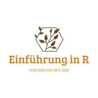

# Einführung in die Open-Source-Software R 
_Autoren: Jakob Schumacher(1), Florian Beese(1), Laura Arnold(2), Nicole Rosenkötter(2)_  
_Affiliations: (1) Robert Koch-Institut, (2) Akademie für öffentliches Gesundheitswesen_

## Über die Fortbildung
In der Fortbildung lernen Sie die Programmiersprache R und die Entwicklungsumgebung RStudio kennen. Die Fortbildung richtet sich vor allem an Anfänger:innen, es sind keine Vorkenntnisse in R notwendig - Basiskenntnisse der Statistik sind jedoch von Vorteil. 

Die Anmeldung erfolgt bei der Akademie für öffentliches Gesundheitswesen.   

* Herbst 2023 [https://www.akademie-oegw.de/fortbildung/details/e-132023](https://www.akademie-oegw.de/fortbildung/details/e-132023)

### Inhalte der Schulung
In der Fortbildung erhalten Sie neben einer kurzen Einführung in die Grundlagen der Programmierung mit Base R, eine theoretische und praktische Einführung in die moderne Datenanalyse mit Tidyverse: Sie lernen Daten einzulesen, mit tidyr umzustrukturieren und mit dplyr zu verarbeiten und zu aggregieren. Außerdem lernen Sie in Ansätzen ggplot2 Grafiken und die Anwendung von R Markdown kennen. Begleitend erhalten Sie einen Einblick in einfache statistische Auswertungen mit R.

Neben den theoretischen Einblicken, werden wir von Beginn an praktisch arbeiten und Sie erlernen, wie aus einem R-Skript ein Kurzbericht entstehen kann. Am zweiten Tag können Sie das Erlernte mit Ihren eigenen Daten nachvollziehen. Bringen Sie deshalb bitte einen eigenen Datensatz und eine einfache eigene Fragestellung zur Bearbeitung und Auswertung ihrer Daten mit.

Vorausgesetzt wird: Ein Laptop auf dem R installiert ist (möglichst >= R version 4.1.3) und RStudio (möglichst >= 2022.07.1).

__Tag 1__  

* Begrüßung und Einführung in den Kurs
* SHOWCASE: Vom R-Script zum Kurzbericht
* SETUP: Installation und Kennenlernen von RStudio
* [SEHEN & NACHMACHEN 1: Variablentypen und einfache Operationen](sehen_nachmachen/1_Variabltentypen_und_einfache_operationen.R)  
* [SEHEN & NACHMACHEN 2: R-Packages Tidyverse, inkl. ggplot](sehen_nachmachen/2_Packages Tidyverse.R)  
* [SEHEN & NACHMACHEN 3: Daten einlesen und transformieren](sehen_nachmachen/3_Daten_lesen_transformieren.R)  
* [SEHEN & NACHMACHEN 4: Grafiken und Bericht erstellen](sehen_nachmachen/4_Grafiken_und_Bericht.Rmd)  

__Tag 2__  

* PRAXIS: Freies Arbeiten mit R
* TEASER 1: Github
* TEASER 2: Kartenerstellung
* TEASER 3: ChatGPT
* Resümee des Kurses und Abschluss

--- 

## Über dieses Repository
Dieses Repository enthält alle notwendigen Datein für den Kurs

* 01_Sehen_und_Nachmachen.R ist die Basis-Datei für den Kurs. Am Tag 1 gehen wir dieses Script durch. 
* 02_Showcase_OEGD_Bericht.Rmd ist ein Beispielbericht
* 03_Showcase_Karte.Rmd ist eine Beispielkarte
* __Datei INKAR.csv__  Die Datei stammt aus der [Datenbank INKAR](https://www.inkar.de/). Die Datei wurde von BBSR heruntergeladen. BBSR ist an der Erstellung dieses R-Scriptes nicht beteiligt.
* __Datei__ 

## Bildquellen und Credits
Logo - [https://www.freelogodesign.org/](https://www.freelogodesign.org/)  
Hosting [Github.com](https://github.com)  
Software R [R-Project.org](https://www.r-project.org/)  
Software RStduio [Posit.com](https://posit.com)  
Inhalte [Epidemiologist R Handbook](https://epirhandbook.com/en/)
Inhalte [R epidemics consortium](https://www.repidemicsconsortium.org/)
